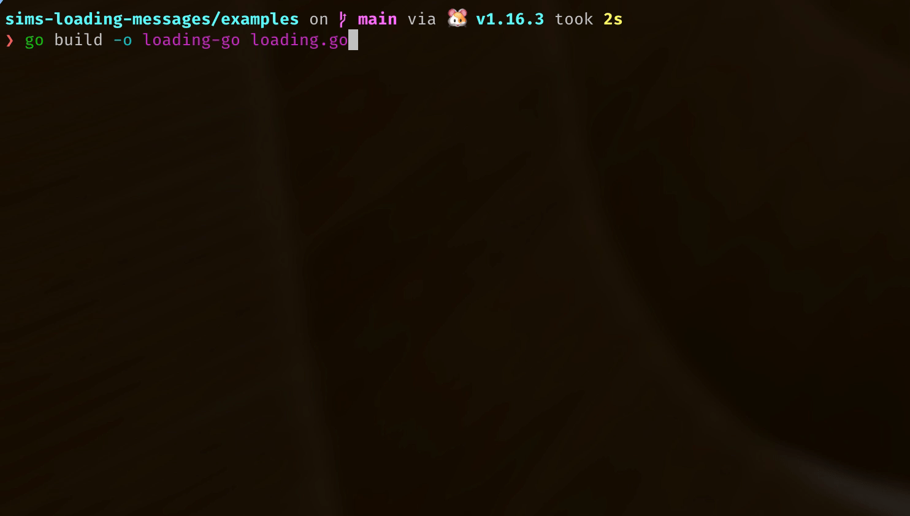

### Examples

If you just want to add some messages to your program quickly (and you know it'll have internet access), you can use the API!

##### Bash

See [loading.sh](./loading.sh)...

Run: `./loading.sh`

##### GoLang

See [loading.go](./loading.go)...

Build: `go build -o loading-go loading.go`

Run: `./loading-go`

